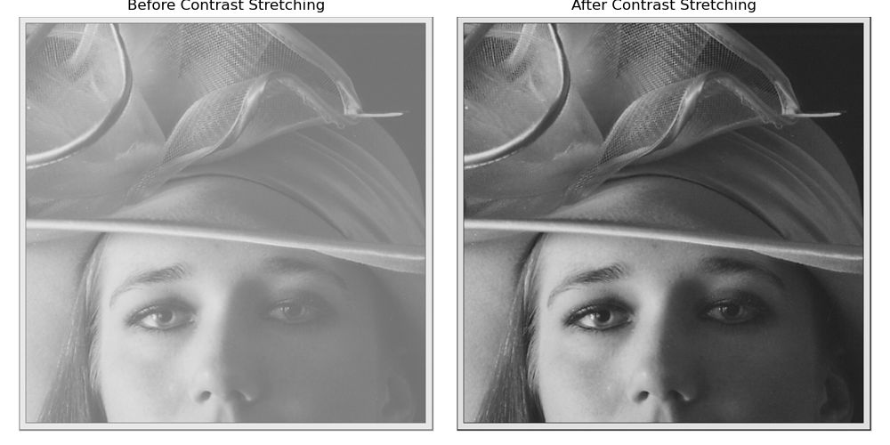
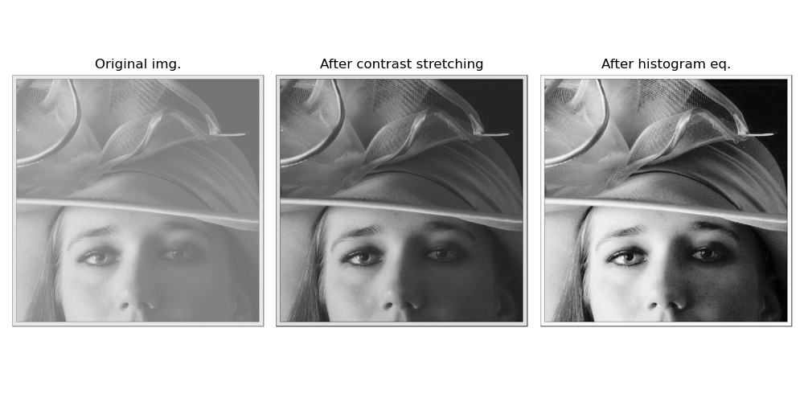
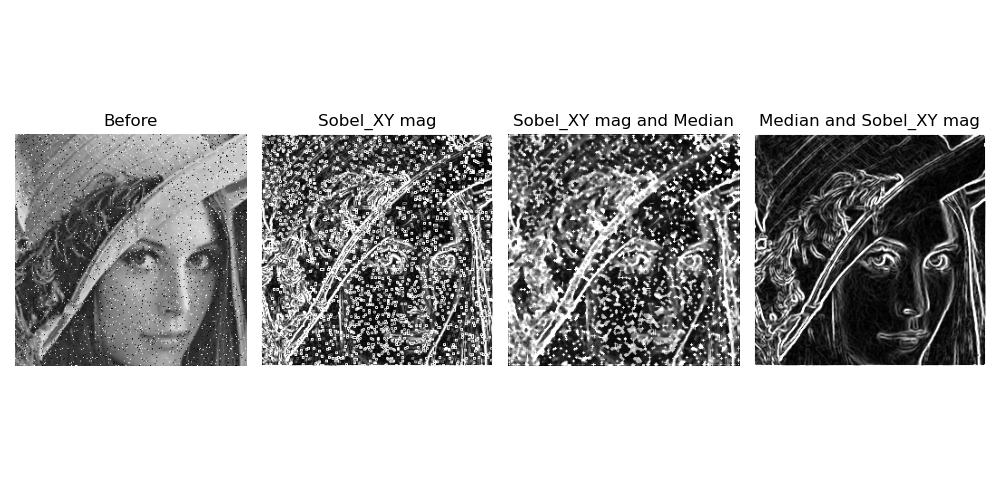
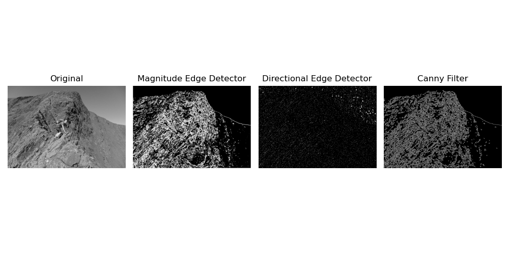

# Exercise 1: Intensity Transformations and Histogram Equalization

1. new_img = contrast_stretch(img, r_min, r_max) implementation.

    ```py
    def contrast_stretch(img, r_min, r_max):
        return ((img - r_min) / (r_max - r_min) * 255.0)
    ```

    This function applies a linear contrast stretching transformation, rescaling all pixel intensities from the original range [r_min, r_max] to the full display range [0, 255].

    The result is a clearer, higher-contrast image with improved visual detail and separation between intensity levels.

    

2. def calculate_histogram(img, bins) implementation

    ```py
    def calculate_histogram(img, number_of_bins):
        # Create an empty array of zeros for counting
        counts = np.zeros(number_of_bins, dtype=int)

        # Compute bin width
        bin_width = 256 / number_of_bins  # 256 levels, 8-bit

        # Flatten the image to 1D
        flat = img.flatten()

        for pixel in flat:
            # Determine which bin this pixel belongs to
            bin_index = min(int(pixel // bin_width), number_of_bins-1)
            
            # Increment count for that bin
            counts[bin_index] += 1

        total_pixels = flat.size
        dist = counts / total_pixels

        return counts, dist 
    ```

3. new_img = equalize_histogram(img) implementation

    ```py
    def equalize_histogram(img, n_bins):
        counts, normalized = calculate_histogram(img, n_bins)

        # Cumulative Distribution Function
        cdf = np.cumsum(normalized)

        # New intensity mapping per bin
        lut = np.floor(255 * cdf).astype(np.uint8)

        bin_idx = (img.astype(np.int32) * n_bins) // 256
        bin_idx = np.clip(bin_idx, 0, n_bins - 1)
        
        return lut[bin_idx]
    ```
    
    This function computes counts and normalized counts using ```calculate_histogram```, accumulates it into a CDF, scales that CDF to 0–255 to form a lookup table, and then remaps each pixel via its bin.
    
    


## Comparison
Although both methods work really well, the histogram eq. result is much sharper. Our human eye can identify details we couldn’t before (e.g., the spots on the subject’s face). We also notice a much more glaring separation between the subject and the background.



# Exercise 2: Non-Linear Filtering and Edge Detection

1. new_img = median_filter(img, size=3) implementation
    ```py
    def median_filter(img, size=3):
        # Find how much padding should be added
        k = size // 2
        # Add padding of 0
        g_pad = np.pad(img, k)
        h, w = img.shape
        # Create output image array
        out = np.empty_like(img)

        # Go through all pixels of the image
        for y in range(h):
            for x in range(w):
                # Select SizexSize window
                window = g_pad[y:y+size, x:x+size]
                
                #Set out pixel to median
                out[y, x] = np.median(window)
        return out.astype(img.dtype)
    ```
2. grad_magnitude = calculate_gradient(img) implementation
    ```py
    import math

    def apply_convolution(img: np.ndarray, kernel: np.ndarray) -> np.ndarray:
        k = kernel.shape[0]
        r = k // 2

        # Pad the image with edges meaning we have a padding of r pixels on each side
        padded = np.pad(img, ((r, r), (r, r)))
        H, W = img.shape
        out = np.zeros((H, W), dtype=np.float32)
        ker = kernel.astype(np.float32)

        for y in range(H):
            for x in range(W):
                acc = 0.0
                for j in range(-r, r+1):
                    for i in range(-r, r+1):
                        acc += float(padded[y + j + r, x + i + r]) * float(ker[j + r, i + r])
                out[y, x] = acc
        
        return out

    sobel_x = np.array([[-1,-2,-1],
                        [ 0, 0, 0],
                        [ 1, 2, 1]], dtype=np.float32)
                                
    sobel_y = np.array([[-1,0,1],
                        [-2,0,2],
                        [-1,0,1]], dtype=np.float32)

    def calculate_gradient(img):
        sobel_x_img = apply_convolution(img, sobel_x)
        sobel_y_img = apply_convolution(img, sobel_y)

        H, W = sobel_x_img.shape
        # Output image array
        mag = np.empty((H, W), dtype=np.float32)

        # Go through every pixel
        for y in range(H):
            for x in range(W):
                gx = float(sobel_x_img[y, x])
                gy = float(sobel_y_img[y, x])
                mag[y, x] = math.sqrt(gx*gx + gy*gy)
        return mag


    ```

## Analysis


We can see that noise is pretty much prevalent after the magnitude calculation. Because salt-and-pepper noise is basically outliers, our Sobel filters pretty much output it back into the gradient. Since we are applying the median after the Sobels, the context pixels (around the pixel) that would have stabilized the median filter are gone, the magnitude image is mostly edges and spikes and therefore the median doesn’t get rid of the noise.

If we apply it in reverse order, median and after that magnitude, we can see a much better featurization of our image. (Last image left to right)

# Exercise 3: Simple Sobel-based edge detector

1. Extend the previous implementation of calculate_gradient() to also calculate the gradient direction, $\theta$

    ```py
    def calculate_gradient(img: np.ndarray):
        gx = apply_convolution(img, sobel_x)
        gy = apply_convolution(img, sobel_y)

        H, W = gx.shape
        grad_magnitude = np.empty((H, W), dtype=np.float32)
        grad_angle     = np.empty((H, W), dtype=np.float32)  # radians in [-pi, pi]

        for y in range(H):
            for x in range(W):
                gxx = gx[y, x]
                gyy = gy[y, x]
                grad_magnitude[y, x] = math.sqrt(gxx*gxx + gyy*gyy)
                grad_angle[y, x]     = math.atan2(gyy, gxx)

        return grad_magnitude, grad_angle
    ```

2. edge_map = sobel_edge_detector(img, threshold) implementation

    ```py
    def sobel_edge_detector(img, threshold):
        out_img_mag, _ = calculate_gradient(img)
        return (out_img_mag >= threshold).astype(np.uint8) * 255
    ```

3. edge_directional_map = directional_edge_detector(img, direction_range) implementation

    ```py
    def directional_edge_detector(img, direction_range):
        _, out_img_dir = calculate_gradient(img)
        
        deg = (np.degrees(out_img_dir) + 360.0) % 360.0
        low, high = direction_range
        mask = (deg >= low) & (deg <= high)

        return (mask.astype(np.uint8) * 255)
    ```

## Analysis

- Our detectors depend heavily in the parameters.
- For the parameters used, magnitude edge detector (thresh=127) performs really well, while directional edge detector (thresh=(40, 50)) is not really helpful.
- Canny Filter does a really good job finding the edges of the image even with no hard parameters inputted.
