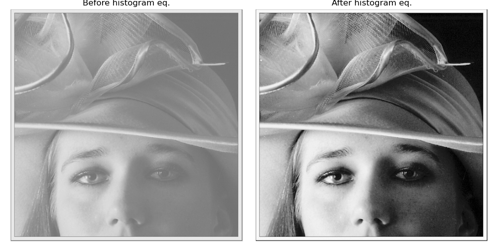

# Exercise 1: Intensity Transformations and Histogram Equalization

1. new_img = contrast_stretch(img, r_min, r_max) implementation.

    ```py
    def contrast_stretch(img, r_min, r_max):
        return ((img - r_min) / (r_max - r_min) * 255.0)
    ```

    This function applies a linear contrast stretching transformation, rescaling all pixel intensities from the original range [r_min, r_max] to the full display range [0, 255].

    The result is a clearer, higher-contrast image with improved visual detail and separation between intensity levels.

    

2. def calculate_histogram(img, bins) implementation

    ```py
    def calculate_histogram(img, number_of_bins):
        # Create an empty array of zeros for counting
        counts = np.zeros(number_of_bins, dtype=int)

        # Compute bin width
        bin_width = 256 / number_of_bins  # 256 levels, 8-bit

        # Flatten the image to 1D
        flat = img.flatten()

        for pixel in flat:
            # Determine which bin this pixel belongs to
            bin_index = min(int(pixel // bin_width), number_of_bins-1)
            
            # Increment count for that bin
            counts[bin_index] += 1

        total_pixels = flat.size
        dist = counts / total_pixels

        return counts, dist 
    ```

3. new_img = equalize_histogram(img) implementation

    ```py
    def equalize_histogram(img, n_bins):
        counts, normalized = calculate_histogram(img, n_bins)

        # Cumulative Distribution Function
        cdf = np.cumsum(normalized)

        # New intensity mapping per bin
        lut = np.floor(255 * cdf).astype(np.uint8)

        bin_idx = (img.astype(np.int32) * n_bins) // 256
        bin_idx = np.clip(bin_idx, 0, n_bins - 1)
        
        return lut[bin_idx]
    ```
    
    This function computes counts and normalized counts using ```calculate_histogram```, accumulates it into a CDF, scales that CDF to 0–255 to form a lookup table, and then remaps each pixel via its bin.
    
    


## Comparison
Although both methods work really well, the histogram eq. result is much sharper. Our human eye can identify details we couldn’t before (e.g., the spots on the subject’s face). We also notice a much more glaring separation between the subject and the background.

