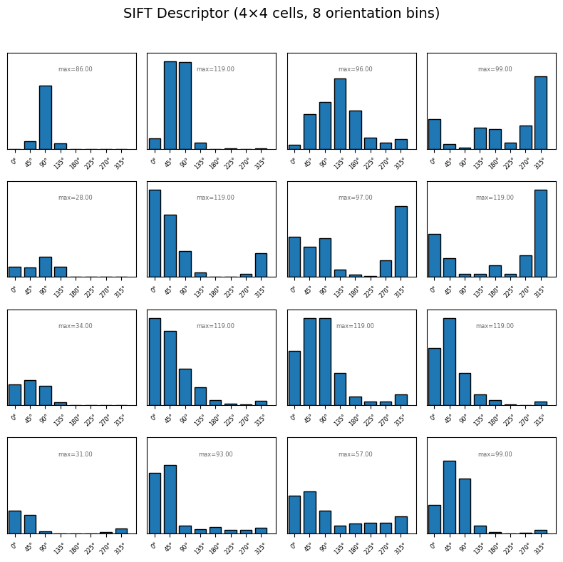
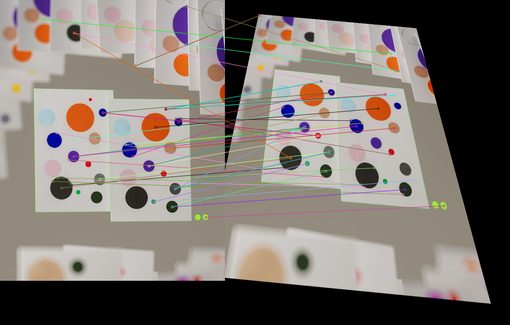
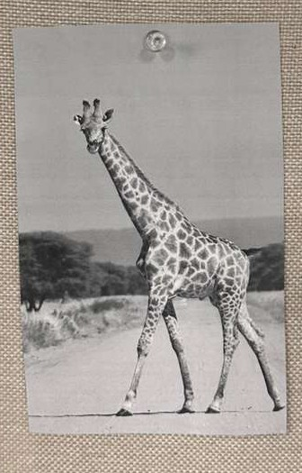
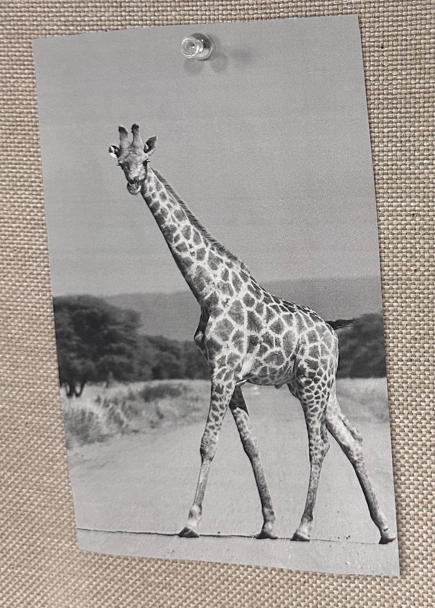
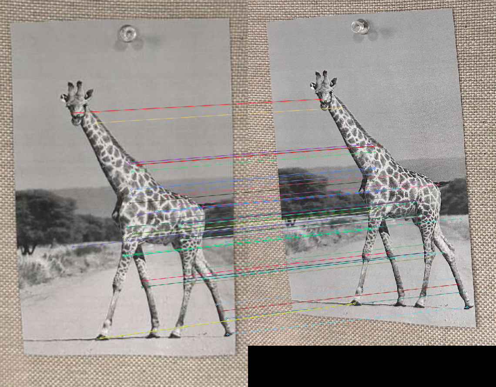

# Part 1: Blob Detection


The results generally confirm the expected behavior of the SIFT detector, that larger keypoints are drawn around larger blobs, and smaller circles correspond to smaller blobs. However, the overall accuracy is not ideal. By visual inspection, approximately 35 keypoints appear to be correctly localized, while around 45 seem misaligned, including several that do not intersect with any prominent blob region.

# Part 2: Tunning blob detection performance

## Tuned Parameters
We were seeing a lot of mispredictions, so I increased the contrastThreshold (0.08) to filter out weak, low-contrast detections. I also lowered the edgeThreshold (5) to make edge filtering stricter, since edges might have been influencing some of those false keypoints. Finally, I slightly reduced sigma (1.2) to apply less blur in the first octave, as too much smoothing might have been merging nearby blobs.

.png)

With these changes, we’re seeing fewer mispredictions overall, about 18 out of 48 blobs correctly detected. Most detections happen near the center of the image, while blobs at the top and bottom are still missed, I'm thinking is likely because of border effects or how the detection window behaves near the edges.

# Part 3: Descriptors



The SIFT descriptor is a vector of 128 values that represents sequentially, the gradient orientation counts across 8 bins for each of the 16 cells (arranged in a 4×4 grid) around the keypoint, so $4×4×8$. These cells are part of a fixed grid, design choice of SIFT.

Each value reflects how strong the gradient is in a given direction within that local area. This pattern of angle counts forms a distinctive signature of the keypoint’s neighborhood, allowing SIFT to recognize the same feature across images even when there are changes in rotation, scale, or lighting.

# Part 4: Feature Matching

Matches between example-image and example-image-transfomed.




# Part 5: SIFT Matching with Your Own Images (Grad Only)

We are performing **SIFT feature matching** between these two images of a giraffe.

| Image 1 (Giraffe) | Image 2 (Giraffe) |
|---|---|
|  |  |

We can notice that the background is rough and full of texture, this will probably be picked up as blobs with the normal parameters. I boosted sigma to the maximum to smooth out those unwanted background blobs. The giraffe’s spots have strong contrast, so increasing the contrastThreshold helps focus on those areas instead of random noise. I also increased the edgeThreshold to reduce keypoints forming along fine edges or textured areas in the background.

### Final Tuned SIFT Parameters
```python
sift_tuned = cv.SIFT_create(
    contrastThreshold=0.09,
    edgeThreshold=20,
    sigma=2
)
```

We can see that the top 50 matches align almost perfectly with actual features in both images. This happens thanks to the fine-tuning done earlier, which helps focus on truly distinctive areas that can be considered real features. Since the two images aren’t drastically different, the matching performs very well overall, giving us strong and consistent results.




